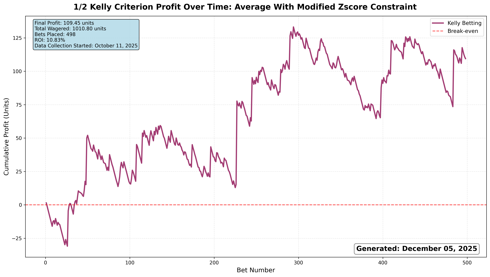
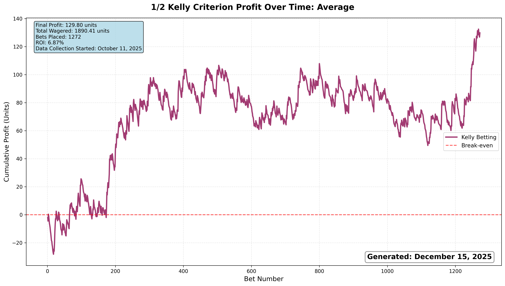
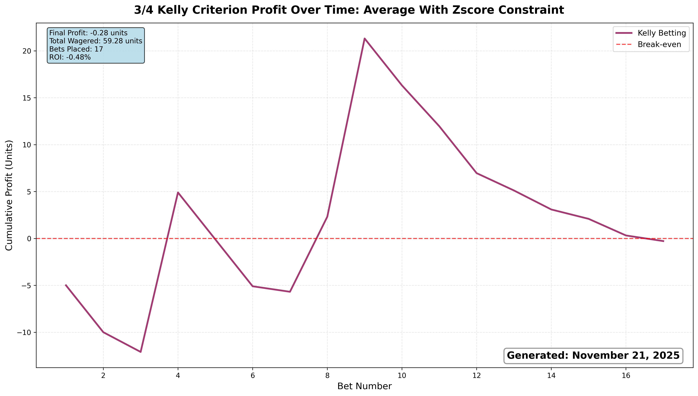
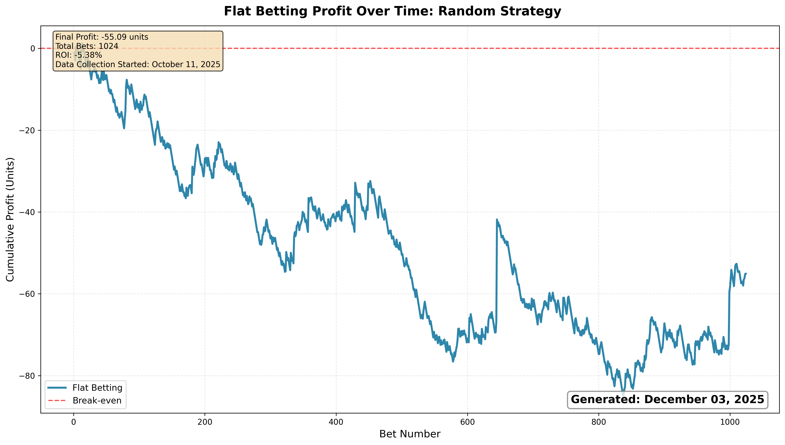

# Paper Betting Tracker

This project is an automated system that tracks sports bets and results using Python scripts and CSV files. It fetches odds from The-Odds-API, analyzes profitable bets using several strategies, and logs results for further analysis. Currently, only moneyline/head-to-head bets are considered, and only North Carolina books are "placed" on. All sports leagues provided by The-Odds-API are considered for betting. Data collection for the below results began October 11th, 2025. This project is inspired by the following paper published by Kaunitz, Zhong, and Kreiner: https://arxiv.org/vc/arxiv/papers/1710/1710.02824v1.pdf.

## Results






## Betting Strategies
- Fair average odds: Calculates the vig-free (true) probability for an outcome from every bookmaker, then averages these probabilities to determine a consensus fair payout. Identifies betting opportunities where the best available odds offer higher payouts than this fair average suggests the outcome is worth.
- Z-score: Combines the fair average approach with statistical outlier detection. First filters for bets that exceed the fair average threshold, then applies an additional constraint requiring the best odds to be a certain distance away from the average to be considered profitable. This dual-filtering approach targets bets that are both fundamentally undervalued and anomalously priced.
- Modified Z-score: Uses the same dual-constraint approach as the Z-score strategy but employs a more robust statistical method. Instead of using mean and standard deviation (which can be skewed by extreme values), it uses median and median absolute deviation to identify outliers.
- Pinnacle edge: Compares available odds against Pinnacle Sportsbook's vig-free probabilities rather than a consensus average. Pinnacle is widely considered a "sharp" bookmaker with efficient pricing, so this strategy assumes Pinnacle's odds represent true market value and looks for opportunities where other bookmakers offer significantly better payouts.
- Random: Control strategy that randomly selects a small number of outcomes (0-5) and places bets on their best available odds, regardless of any mathematical analysis. This serves as a baseline to measure whether the analytical strategies actually outperform chance-based betting over time.

## Data Files Types
- *_bets.csv: A minimal file with only essential information for each bet placed.
- *_full.csv: A file with all bookmakers and odds that were available, not just the odds of the bookmaker placed.

## Usage
1. Install dependencies:
   ```bash
   pip install -r requirements.txt
   ```
2. Fetch odds and analyze bets:
   ```bash
   python3 -m codebase.find_bets.find_bets
   ```
3. Update results:
   ```bash
   python3 -m codebase.results_appending.results
   ```

4. View strategy profit/ROI:
   ```bash
   python3 -m codebase.analysis.roi
   ```

## Automation
- GitHub Actions workflows automatically runs bet finding script 7 times an hour and results updating script 1 time every 6 hours.
- Updated CSVs are committed to the repository.

## Author
- Andrew Smith
