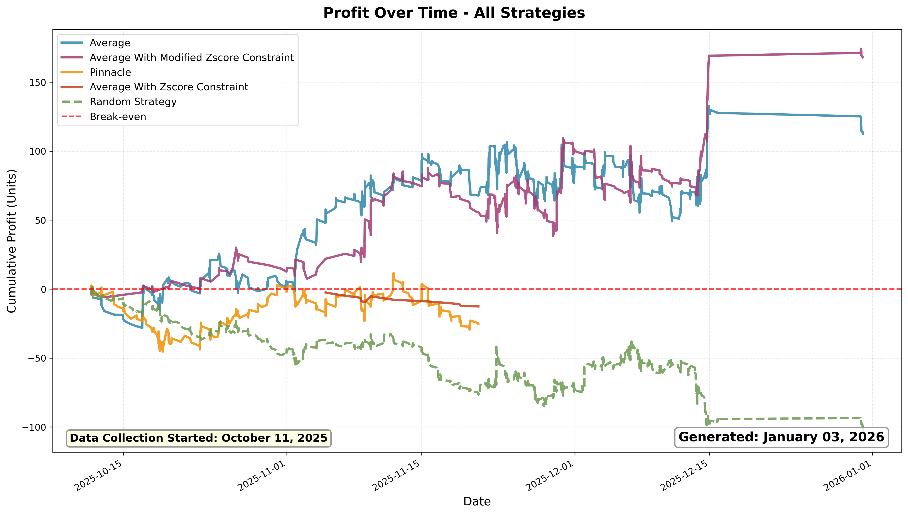
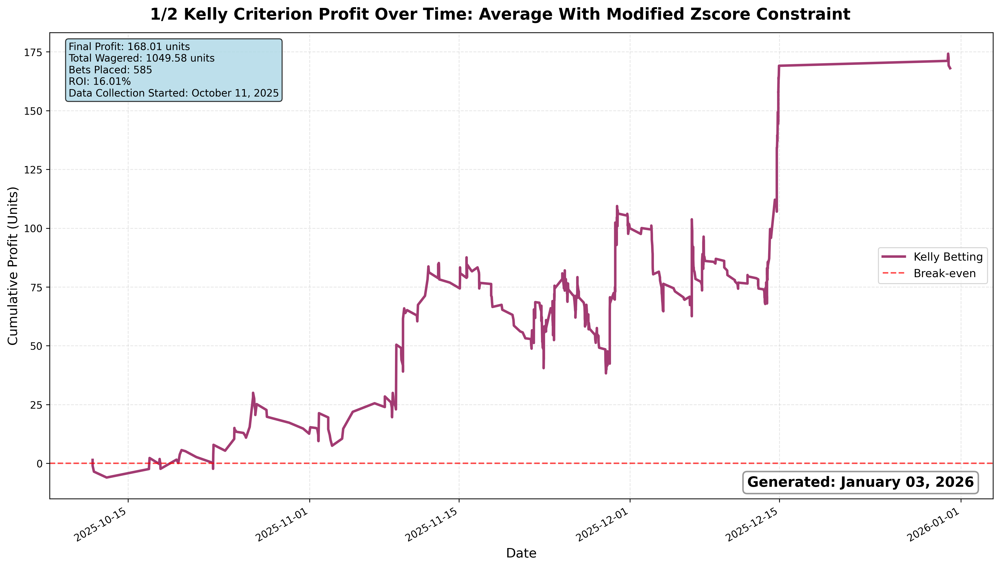
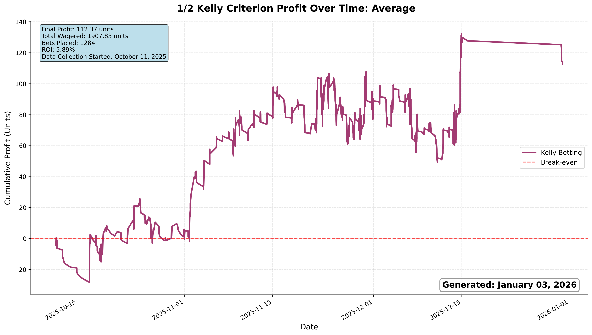
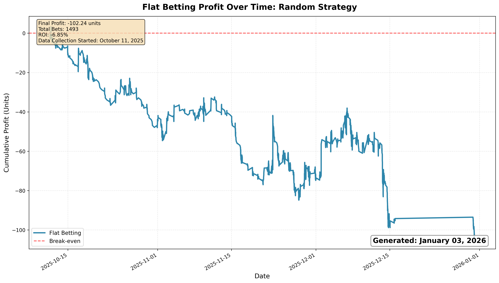

# Paper Betting Tracker

This project is an automated system for tracking and evaluating “paper” sports bets—bets that are recorded for analysis but do not involve real money. Using Python scripts and CSV files, the system fetches live odds from The-Odds-API, identifies potentially profitable bets using two strategies, and logs outcomes for downstream analysis.

Currently, the system considers only moneyline (head-to-head) bets and simulates placements exclusively on North Carolina sportsbooks, while evaluating all sports leagues supported by The-Odds-API. Data collection for the reported results began on October 11, 2025.

## Results






## Betting Strategies

### Fair Average Odds
Calculates the vig-free (true) probability for an outcome from every bookmaker, then averages these probabilities to determine a consensus fair payout. Identifies betting opportunities where the best available odds offer higher payouts than this fair average suggests the outcome is worth.

### Pinnacle Edge
Compares available odds against Pinnacle Sportsbook's vig-free probabilities rather than a consensus average. Pinnacle is widely considered a "sharp" bookmaker with efficient pricing, so this strategy assumes Pinnacle's odds represent true market value and looks for opportunities where other bookmakers offer significantly better payouts.

### Random (Control)
Randomly selects a small number of outcomes (0–5) and places bets on their best available odds, regardless of any mathematical analysis. This serves as a baseline to measure whether analytical strategies outperform chance-based betting over time.


## Data Files Types

### *_bets.csv
A minimal file with only essential information for each bet placed.
### *_full.csv
A file with all bookmakers and odds that were available, not just the odds of the bookmaker placed.

## Usage

1. Install dependencies:
   ```bash
   pip install -r requirements.txt
   ```
2. Fetch odds and analyze bets:
   ```bash
   python3 -m src.find_bets.find_bets
   ```
3. Update results:
   ```bash
   python3 -m src.results.results
   ```

4. View strategy profit/ROI:
   ```bash
   python3 -m src.analysis.roi
   ```

## Automation

- GitHub Actions workflows automatically runs bet finding script 7 times an hour and results updating script 1 time every 6 hours.
- Updated CSVs are committed to the repository.

## Author

Andrew Smith
